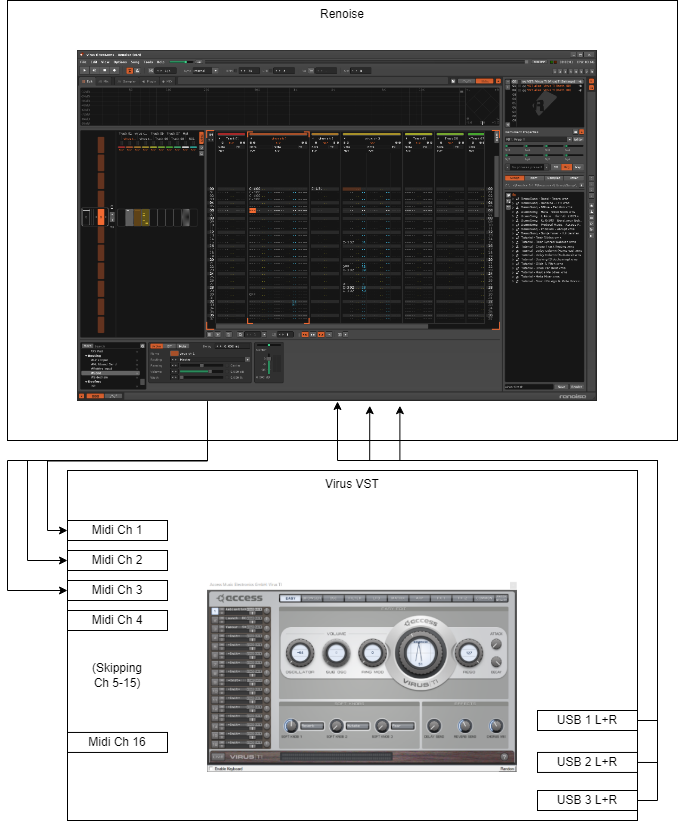

# Using the Access Virus TI series with Renoise

How to:

- Make sure Renoise finds the VST
- Map everything needed
  - First Renoise track to VST
  - Setting up USB busses
  - Add more tracks using plugin aliases
    - Midi channels & VST
    - Audio routing

Other ideas:

- Running effects through the Virus TI
